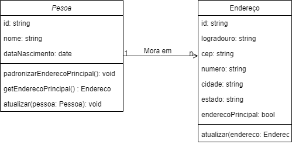

# Gerenciamento Pessoas API

Aplicação para gerenciamento de pessoas e seus endereços.

## Integrantes
| Nome                                  |
|---------------------------------------|
| João Vitor Santana Depollo            |
| Marcos Paulo Ferreira de Souza        |
| Pedro de Oliveira Guedes              |
| Tatiana Alvares Guimaraes de Oliveira |

# Funcionalidades
- Criar, editar e consultar uma ou mais pessoas;

- Criar, editar e consultar um ou mais endereços de uma pessoa; e

- Poder indicar qual endereço será considerado o principal de uma pessoa.

# Domínio
- Nome completo

- Data de nascimento

- Endereços:

    - Logradouro

    - CEP

    - Número

    - Cidade

    - Estado

Ao salvar uma pessoa, o primeiro endereço cadastrado será considerado como principal.


# Tecnologias
- Java 17
- Spring Boot 3.2.5
- Lombok
- H2 Database
- Swagger
- JUnit
- Maven
- Jacoco

# Arquitetura
A aplicação foi implementada baseado nos princípios da clean architecture, com a separação de camadas de acordo com suas responsabilidades.
- domain: 
  - Contém as entidades e regras de negócio da aplicação.
  - Gateways para comunicação com a camada de infraestrutura.
  - Interactors para implementação das regras de negócio.
- infrastructure:
  - Contém as implementações dos gateways definidos na camada de domínio.
  - Implementações dos controllers e configurações do Spring Boot.

# Execução e Build

O projeto pode ser executado de duas formas: localmente ou via container Docker.

## Local
O projeto pode ser buildado com o seguinte comando do Maven:
```shell
mvn clean install
```
Após o build, o projeto pode ser executado com o comando:
```shell
java -jar target/api-gerenciamento.jar
```
O projeto estará disponível em http://localhost:8080

## Docker

A imagem está integrada ao Docker Hub, com CI/CD no GitHub Actions. Para executar o projeto via Docker, basta executar o seguinte comando:
```shell
docker run -p 8080:8080 -d --name api-gerenciamento joaovitorsd/engenharia-software-tp
```

## Seed de Dados
Para facilitar o teste da aplicação, foi criado um seed de dados que é carregado ao iniciar a aplicação. O seed é composto por um loop que gera pessoas entre 1 e 3 endereços. 
Para desativar o seed, basta não passar a variável de ambiente `${SEED.DATA}` ou passar o valor `false`. 
### Frontend
**Além da imagem backend, também foi criada uma imagem frontend com React.** que pode ser executada via docker-compose. Para isso, basta executar o seguinte comando:
```shell
docker-compose pull
docker-compose up
```
Este comando irá rodar o frontend na porta 3000 e o backend na porta 8080.
